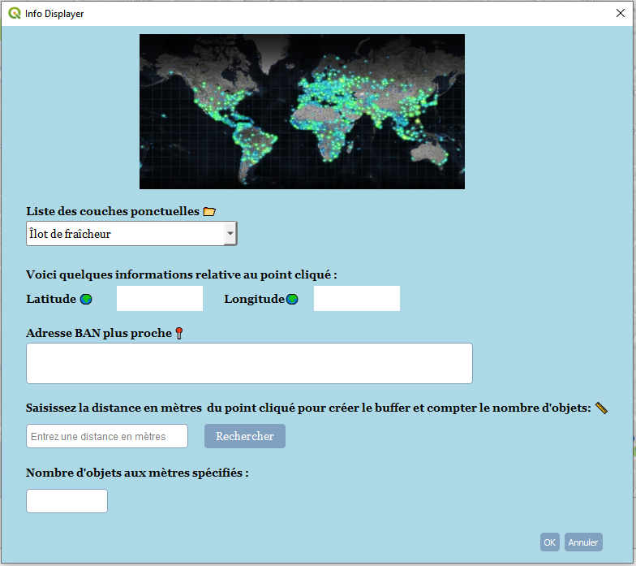

# **InfoDisplayer - Plugin QGIS**  



## 📌 **Description**
InfoDisplayer est un plugin pour QGIS permettant d'afficher et d'analyser des informations géographiques autour d'un point sélectionné. Il inclut les fonctionnalités suivantes :

    - Selection des couches ponctuelles à partir de votre projet.
    - Affichage des coordonnées du point cliqué en WGS 84 (EPSG:4326).
    - Récupération de l'adresse BAN la plus proche via l'API GéoPlateforme.
    - Calcul d'une zone tampon autour du point cliqué.
    - Comptage des objets présents dans la zone tampon.
    - Affichage du buffer sur la carte avec un style personnalisé. 

Voici un **README** clair et bien structuré pour ton plugin QGIS. Il inclut une section expliquant comment ajouter une **capture d'écran** dans le fichier `README.md`.  

---

## 🚀 **Installation**  
1. Télécharger le dépôt du plugin sous format .zip.  
2. Placez le dossier après l'avoir dézipé dans votre répertoire des plugins QGIS qui peut ressembler à:  

- Pour Windows :
```
C:\Users\XXX\AppData\Roaming\QGIS\QGIS3\profiles\default\python\plugins
```
- Pour Linux :
```
/home/XXX/.local/share/QGIS/QGIS3/profiles/default/python/plugins
```
3. Ouvrir **QGIS**, aller dans **Extensions → Gérer et installer les extensions**.  
4. Activer **InfoDisplayer**.  

---

## 🎯 **Utilisation**  
1. Sélectionner une couche contenant des entités ponctuelles.  
2. Cliquer sur la carte pour capturer un point, et afficher ses coordonnées géographiques, et obtenir l’adresse la plus proche ( voie: son numéro, type et nom ; code insee; nom de commune) du point selectionné avec le curseur "+".  
3. Appuyer sur le bouton "Rechercher" pour :  
   - Calculer et afficher la zone tampon situé à la distance que tu as saisis.  
   - Afficher le nombre d'objets comptés dans la zone tampon .  


